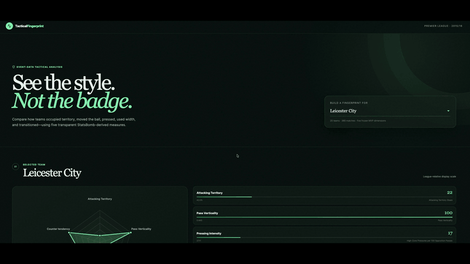
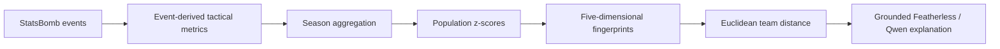

# Tactical Style Fingerprint

An interpretable football analytics system that turns event data from all 380 matches of the 2015/16 Premier League into five-dimensional tactical fingerprints, finds stylistically similar teams, and uses a grounded LLM to explain the calculated comparison.

**[Live demo](https://tactical-style-fingerprint.vercel.app)** · **[How it works](#how-it-works)** · **[Run locally](#run-locally)**



The similarity engine is deterministic and interpretable. The LLM does **not** decide which teams are similar; it only explains statistics already calculated by the analytics pipeline.

## Example result

### Liverpool ↔ Tottenham Hotspur — tactical distance `0.620`

Liverpool and Tottenham are the closest pair in this five-feature Premier League 2015/16 model. Their standardized values are particularly close for Attacking Territory, Pass Verticality, Pressing Intensity, and Attacking Width; Counterattacking Tendency is the larger remaining difference.

Leicester City provides a useful contrast: lower Attacking Territory (`42.0%`) alongside the league's highest Pass Verticality (`0.445`) and From-Counter Possession Rate (`6.91` per 100 eligible possession changes). These are model results for this league-season—not universal descriptions of the clubs or measures of quality.

## How it works



1. Five transparent metrics are calculated from StatsBomb Open Data and aggregated over the season.
2. Each feature is standardized across the 20 teams with a population z-score: `z = (value - league mean) / league standard deviation`.
3. Every team becomes a point in five-dimensional space. Euclidean distance measures the gap between two points; smaller means closer.
4. The backend gives Featherless structured evidence—raw values, z-scores, signed differences, distance, definitions, and limitations. The model explains that evidence but never changes the ranking.

### The five dimensions

| Dimension | Raw metric | What it captures | Implementation |
|---|---|---|---|
| Attacking Territory | Attacking Territory Share | Share of the two teams' completed passes attempted from the final third (`x >= 80`) made by the focal team | [`attacking_territory_share_season.py`](analysis/attacking_territory_share_season.py) |
| Pass Verticality | Pass Verticality | Forward orientation of non-restart attempted passing, weighted by pass distance | [`pass_verticality_season.py`](analysis/pass_verticality_season.py) |
| Pressing Intensity | High-Zone Pressures per 100 Opposition Passes | Pressure events at `x >= 48` per 100 opponent non-restart passes attempted from `x <= 72` | [`high_zone_pressures_season.py`](analysis/high_zone_pressures_season.py) |
| Attacking Width | Mean Final-Third Destination Width | Lateral distance from the centre of final-third Pass and Carry destinations | [`attacking_width_season.py`](analysis/attacking_width_season.py) |
| Counterattacking Tendency | From-Counter Possession Rate | From-Counter possessions per 100 eligible open-play possession changes | [`from_counter_rate_season.py`](analysis/from_counter_rate_season.py) |

The combined fingerprint and similarity calculations live in [`build_raw_fingerprints.py`](analysis/build_raw_fingerprints.py) and [`calculate_tactical_similarity.py`](analysis/calculate_tactical_similarity.py). Validated derived CSVs are committed under [`data/processed/`](data/processed/), so every displayed value and neighbour can be audited without calling the LLM.

### Similarity and display scales

The production model gives all five standardized dimensions equal weight and uses:

```text
distance(A, B) = sqrt(sum((A_z - B_z)²))
```

Distance is not a probability or a percentage of tactical identity. The UI's separate 0–100 radar values are league-relative min-max display positions and do not enter the similarity calculation.

## Repository structure

```text
analysis/          Metric aggregation, fingerprint construction, similarity, diagnostics
backend/app/       FastAPI data service and grounded Featherless integration
backend/tests/     API, grounding, rate-limit, and graceful-failure tests
data/processed/    Versioned, validated outputs used by the deployed application
frontend/          Next.js App Router interface and visualizations
scripts/           StatsBomb event download utility
docs/              Demo and optional promotion/contributor materials
```

`data/raw/` is deliberately ignored: the downloaded StatsBomb match and event files are a reproducible local cache, while the smaller derived outputs required by the application are versioned.

## Run locally

Requirements: Python 3.10+ and Node.js 20.9+.

### 1. Clone and configure

```bash
git clone git@github.com:OmTheLast/tactical-style-fingerprint.git
cd tactical-style-fingerprint
cp .env.example .env
```

Live explanations are optional. To enable them, set these server-side values in the ignored `.env`:

```dotenv
FEATHERLESS_API_KEY=<your-key>
FEATHERLESS_MODEL=<available-model-id>
```

### 2. Start the backend

```bash
python3 -m venv .venv
source .venv/bin/activate
pip install -r requirements.txt
uvicorn backend.app.main:app --reload --port 8000
```

- Health: <http://localhost:8000/health>
- Interactive API docs: <http://localhost:8000/docs>

### 3. Start the frontend

```bash
cd frontend
npm ci
npm run dev
```

Open <http://localhost:3000>. It defaults to the backend at `http://localhost:8000`.

## Reproduce the offline analysis

The repository includes the full metric pipeline, but not the provider's raw JSON cache. Download the Premier League match list, then the 380 event files:

```bash
mkdir -p data/raw/statsbomb/matches
curl -L https://raw.githubusercontent.com/hudl/open-data/master/data/matches/2/27.json \
  -o data/raw/statsbomb/matches/2-27.json
python scripts/download_season_events.py
```

With the Python environment installed, run the five season aggregations followed by fingerprint construction and similarity:

```bash
python analysis/attacking_territory_share_season.py
python analysis/pass_verticality_season.py
python analysis/high_zone_pressures_season.py
python analysis/attacking_width_season.py
python analysis/from_counter_rate_season.py
python analysis/build_raw_fingerprints.py
python analysis/calculate_tactical_similarity.py
```

The scripts intentionally remain separate so each modelling decision and intermediate CSV can be inspected. They are a documented sequence, not a claimed one-command data pipeline.

## API

| Method | Endpoint | Purpose |
|---|---|---|
| `GET` | `/health` | Verify the API and 20-team dataset |
| `GET` | `/teams` | List teams, season, model, and limitations |
| `GET` | `/teams/{team}/fingerprint` | Return raw, z-score, and display values |
| `GET` | `/teams/{team}/neighbours` | Return the five nearest teams and feature gaps |
| `GET` | `/compare?team_a=...&team_b=...` | Return two fingerprints, distance, and signed differences |
| `POST` | `/explain` | Ask Featherless to explain a structured comparison |

If Featherless is unavailable, only the explanation request fails; fingerprints, neighbours, and comparisons remain usable. The public endpoint also has a modest in-memory rate limit of five explanation attempts per client per ten minutes.

## Deployment

- Frontend: <https://tactical-style-fingerprint.vercel.app>
- Backend: <https://tactical-style-fingerprint-api.onrender.com>
- Health: <https://tactical-style-fingerprint-api.onrender.com/health>

The backend deploys on Render from [`render.yaml`](render.yaml). It receives `FEATHERLESS_API_KEY`, `FEATHERLESS_MODEL`, `FRONTEND_ORIGIN`, and `APP_PUBLIC_URL` as server environment variables. Vercel builds `frontend/` with the public `NEXT_PUBLIC_API_BASE_URL` pointing to Render. The API key is never shipped to the browser.

## Extending the project

Useful extensions should preserve the same small-sample-first, assumptions-explicit workflow:

- **More 2015/16 leagues or seasons:** generalize the match/event inputs used by the season scripts in [`analysis/`](analysis/) and rebuild the combined outputs.
- **Manager eras and season-to-season evolution:** add time-window aggregation before fingerprint construction.
- **PPDA robustness comparison:** add an independent pressing calculation beside—not silently inside—the current pressure-event rate.
- **Independent counterattack definition:** compare the provider's From Counter annotation with a rule-based post-regain fast-progression measure.
- **Tactical archetypes:** explore PCA or clustering only after validating cross-league feature distributions and normalization.
- **Tracking-derived shape and compactness:** add a clearly separate tracking/360 pipeline; ordinary event data cannot observe full-team physical shape.
- **New visualizations:** extend the components in [`frontend/components/`](frontend/components/) while keeping raw values, distance, and limitations visible.

See [`CONTRIBUTING.md`](CONTRIBUTING.md) before proposing a metric or pull request, and browse the [open issues](https://github.com/OmTheLast/tactical-style-fingerprint/issues) for scoped extension ideas.

## Known limitations

- This is Premier League 2015/16 event data only; it is not a universal model of football tactics.
- Attacking Territory and Pass Verticality correlate at `-0.839`, so equal weighting may partly double-count a control/directness axis.
- Attacking Width has a narrow raw range; z-scoring gives it equal variance, and removing it materially changes several neighbour rankings.
- The From-Counter feature depends on StatsBomb's provider-defined annotation.
- Event data cannot measure true formation width, compactness, defensive-line height, marking, or off-ball runs.
- Five dimensions cannot describe the whole tactical behaviour of a team, and “nearest” does not necessarily mean close.
- A grounded prompt reduces hallucination risk but cannot guarantee a perfect LLM explanation.

## Validation

```bash
.venv/bin/python -m pytest -q
npm --prefix frontend run lint
npm --prefix frontend run build
```

## Data and license

Event data comes from [StatsBomb Open Data](https://github.com/hudl/open-data); review its repository terms before redistributing provider data. This project's source code is available under the [MIT License](LICENSE).
